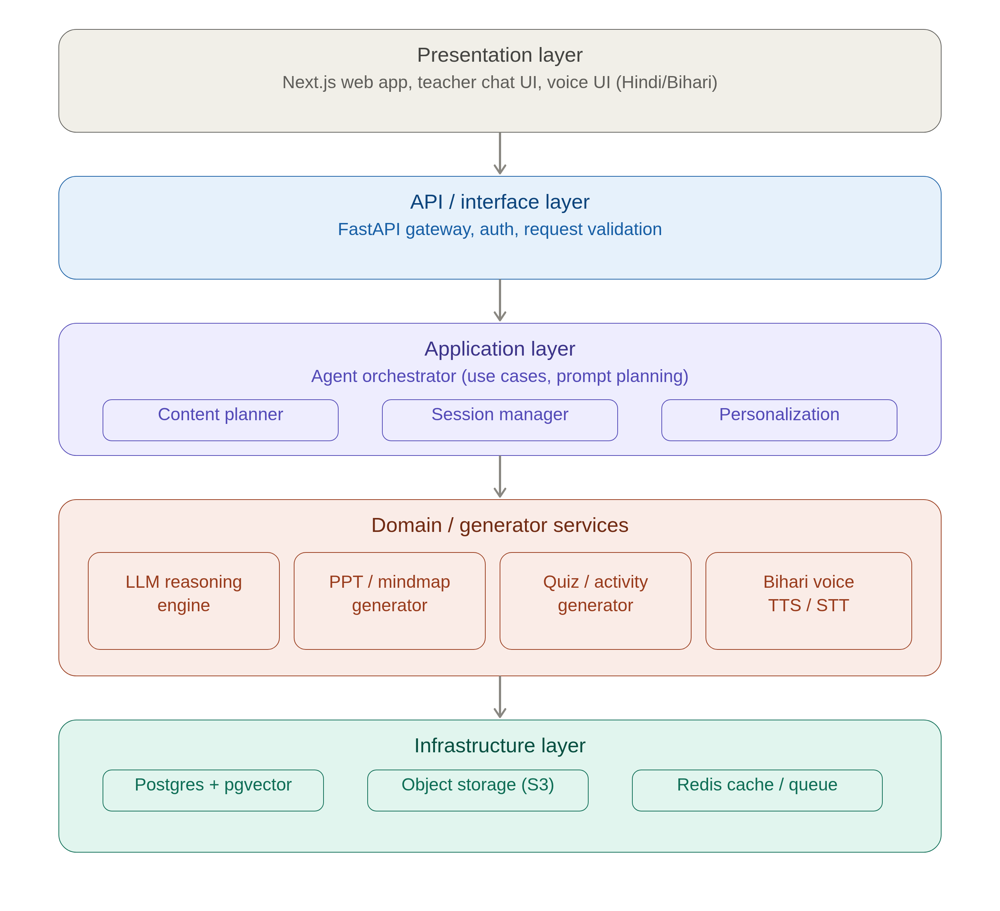
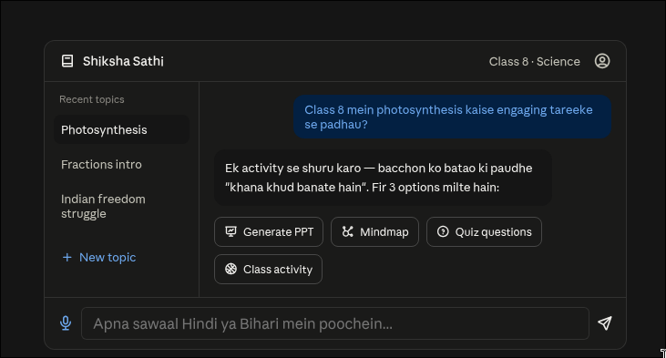

# Medha — AI Teaching Assistant for Bihar Government Schools

### System Architecture & V1 Roadmap

---

## 1. Problem framing (what we're actually building for)

- **Not** a student-facing e-learning app. This is a **teacher co-pilot**.
- The bottleneck isn't subject knowledge — Bihar's government-school teachers are qualified. The bottleneck is **pedagogical creativity**: how to make a topic land with a room of 40+ students who may be first-generation learners, in a low-infrastructure setting.
- The product's single job: a teacher types or speaks *"How do I teach photosynthesis to Class 8 in an engaging way?"* and gets back a ready-to-use lesson kit — explanation angles, a slide deck, a mindmap, discussion questions, and a physical/low-tech classroom activity — in Hindi/Bihari, tuned to their board (BSEB), grade, and subject.
- Corollary constraints this puts on the architecture:
  - **Low bandwidth / patchy internet** — school wifi in rural Bihar is not reliable. Assume 2G/3G is common.
  - **Low-tech classrooms** — most activity suggestions must work without projectors/smart boards (chalk, paper, group work, role-play).
  - **Regional language + accent** — Hindi is the working language; voice interface should be Bihari-accented, not generic Hindi TTS.
  - **Teachers, not developers** — UI must be usable by a 45-year-old teacher on a shared Android phone or an old desktop, not just a young urban user.

---

## 2. Primary user & core flow

**User:** Government school teacher (Bihar), Class 1–12, BSEB syllabus.

**Core loop (V1):**
1. Teacher opens app → selects **class, subject, chapter/topic** (or types it free-form).
2. Teacher asks the assistant (text or voice) *how to explain it* — or picks a quick-action: "Give me a PPT", "Give me a mindmap", "Give me a class activity", "Give me questions to ask".
3. Agent generates a **lesson kit**: teaching approach (2–3 explanation strategies), a downloadable PPT, a mindmap image, 5–10 discussion/quiz questions, and 1 low-tech interactive activity.
4. Teacher can refine ("make it simpler", "give an activity that needs no materials", "explain in a Bihari story style") — this is a conversation, not a one-shot generation.
5. Teacher saves/downloads the kit for offline classroom use (PDF/PPT export is essential — don't assume a live device in class).

---

## 3. High-level architecture (clean architecture, layered)

The diagram above shows the shape: **Presentation → API/Interface → Application (use cases) → Domain/Generator services → Infrastructure**. Dependencies point inward — the agent orchestration logic doesn't know or care whether the frontend is Next.js or a WhatsApp bot; the generator services don't know or care whether the LLM is Claude, GPT, or a fine-tuned open model swapped in later. This is the point of clean architecture here: **the LLM/TTS vendor is a plug-in, not a foundation** — Bihar government procurement, cost, or data-residency requirements can force a vendor swap later, and the system should survive that without a rewrite.

### 3.1 Presentation layer
- **Next.js** web app (React Server Components for fast first paint on slow networks; static generation where possible).
- Mobile-first, works as installable PWA (offline shell caching for low-connectivity areas).
- Voice UI: push-to-talk mic button, Bihari-accented TTS playback for responses.
- Optional future channel: WhatsApp/SMS bot front-end reusing the same backend API (very relevant for low-smartphone-literacy teachers — flag this for V2).

### 3.2 API / interface layer
- **FastAPI** (preferred over Flask for this — native async, Pydantic validation, auto OpenAPI docs, better fit for streaming LLM responses).
- Responsibilities: authentication (teacher accounts, school/district scoping), request validation, rate limiting, routing to the application layer, streaming responses back to the client (SSE/WebSocket for chat-style token streaming).

### 3.3 Application layer (use cases / orchestration)
This is the "agent" — but architecturally it's just an orchestrator, not a monolith:
- **Content planner** — turns "explain photosynthesis engagingly" into a structured plan (what sub-generators to call: explanation strategy, PPT, mindmap, quiz, activity) based on topic + grade + curriculum context.
- **Session/context manager** — keeps conversation state so "make it simpler" or "add a Bihari folk-story analogy" refines the *previous* output rather than starting over.
- **Personalization** — teacher's subject, grade levels taught, and past preferences (e.g. "this teacher likes storytelling-based explanations") bias the planner's prompts.

### 3.4 Domain / generator services
Each is a bounded, independently testable service behind an interface — swappable without touching the orchestrator:
- **LLM reasoning engine** — wraps whichever foundation model is used (Claude via API to start) for the actual pedagogical reasoning: generating explanation strategies, simplifying language, adapting to BSEB syllabus.
- **PPT / mindmap generator** — takes structured content from the LLM and renders an actual `.pptx` (python-pptx) and mindmap image/diagram, not just text.
- **Quiz / activity generator** — structured question sets (MCQ, discussion, true/false) and classroom activity instructions, filtered for "needs no materials" vs "needs basic materials" so it matches real classroom constraints.
- **Bihari voice (TTS/STT)** — speech-to-text for teacher's spoken query, text-to-speech for spoken responses, tuned/fine-tuned or prompted for a Bihari accent rather than neutral Hindi. This is very likely the hardest and most novel component — see section 6.

### 3.5 Infrastructure layer
- **Postgres** (+ pgvector) — teachers, schools, syllabus/curriculum content, saved lesson kits, and embeddings for retrieval (e.g. retrieving relevant NCERT/BSEB textbook passages to ground generation and reduce hallucination).
- **Object storage (S3-compatible)** — generated PPTs, PDFs, mindmap images, audio files.
- **Redis** — caching frequent topic generations (many teachers across Bihar will ask about the same Class 8 Science chapters — cache aggressively), session state, and a job queue for slower generation tasks (PPT rendering, TTS synthesis) so the API isn't blocked.

---

## 4. Preferred tech stack

| Layer | Choice | Why |
|---|---|---|
| Frontend | Next.js (App Router) + Tailwind | SSR for slow networks, PWA-installable, good i18n support for Hindi |
| Backend API | FastAPI | Async-native, streaming support, Pydantic validation, easy to scale |
| Agent orchestration | Python (LangGraph or a hand-rolled orchestrator) | Explicit control over multi-step generation (plan → generate → refine) rather than a black-box agent framework |
| LLM | Claude API (start here); abstracted behind an interface | Strong instruction-following + pedagogical reasoning; swappable later for cost/procurement reasons |
| PPT generation | `python-pptx` | Real editable `.pptx` output teachers can tweak, not just an image |
| Mindmap generation | Server-side SVG/diagram rendering (or Mermaid.js rendered server-side) | Lightweight, no heavy client rendering needed |
| STT | Whisper (fine-tuned/prompted for Hindi-Bihari) or a regional-language ASR API | Needs evaluation against actual Bihari-accented Hindi audio |
| TTS | Regional Indian-language TTS provider (e.g. AI4Bharat's models, or commercial Indic TTS) fine-tuned/prompt-conditioned for Bihari accent | Neutral Hindi TTS will *not* feel personalized — this needs dedicated evaluation, likely a fine-tuning effort with AI4Bharat's open Indic-TTS work as a starting point |
| Database | PostgreSQL + pgvector | Relational data + retrieval-augmented generation in one store |
| Cache/Queue | Redis | Caching + background job queue for generation tasks |
| Storage | S3-compatible object storage | Generated files |
| Deployment | Containerized (Docker) on cloud, with CDN for static assets | Standard, portable |

---

## 5. Data model (core entities)

- **Teacher** — id, name, school, district, subjects taught, grades taught, preferred language/dialect, saved preferences.
- **School** — id, name, district, block, medium of instruction.
- **Curriculum topic** — board (BSEB), grade, subject, chapter, topic, reference textbook passages (for grounding).
- **Lesson kit** — id, teacher_id, topic_id, conversation history, generated artifacts (PPT url, mindmap url, questions, activity text), created_at, refinement_history.
- **Generation job** — async job tracking for PPT/TTS rendering (status, output url).
- **Feedback** — teacher rating/comment on a generated kit (critical for improving prompts over time — this is your product's core feedback loop).

---

## 6. The hard, novel part: Bihari-accented voice

Worth calling out separately since it's the most differentiated (and riskiest) piece:
- Off-the-shelf Hindi TTS (Google, Azure, most commercial APIs) will sound like standard/Delhi Hindi, not Bihari — this will *not* deliver the "personalized, local" feel you want.
- Realistic V1 path: don't block launch on a custom-trained Bihari voice model. Ship with standard Hindi TTS first (functional, low personalization), and treat the Bihari-accent voice as a fast-follow — likely requiring a small voice-data collection effort (recording Bihari teachers/narrators) and fine-tuning an open Indic-TTS model (AI4Bharat's IndicTTS or similar) rather than a commercial API, since commercial providers are unlikely to offer a Bihari dialect out of the box.
- STT (understanding teacher's spoken Hindi/Bihari-accented query) is comparatively easier — Whisper and most modern ASR handle accented Hindi reasonably well already, but should still be evaluated on real sample audio before launch.

---

## 7. V1 roadmap (phased)

**Phase 0 — Foundation (weeks 1–3)**
- Auth + teacher onboarding (school, grade, subject selection).
- Curriculum data ingestion: digitize/structure BSEB Class 6–10 syllabus for at least 2 pilot subjects (e.g. Science + Social Science) to ground generation.
- Basic FastAPI + Next.js scaffolding, deployed.

**Phase 1 — Core text-based assistant (weeks 3–7)**
- Chat interface: teacher asks how to teach a topic, gets back structured explanation strategies (text only).
- Question/quiz generator.
- Low-tech classroom activity generator.
- Feedback capture (thumbs up/down + comment) on every generated kit — this data is gold for iterating prompts.

**Phase 2 — Rich artifacts (weeks 7–11)**
- PPT generation (python-pptx) from the structured content.
- Mindmap generation.
- PDF export of the full lesson kit for offline/print use.
- Caching layer for common topics to cut latency and cost.

**Phase 3 — Voice (weeks 11–15)**
- STT input (spoken Hindi/Bihari query).
- Standard Hindi TTS output first.
- Begin Bihari-accent TTS data collection/fine-tuning track in parallel (this will likely extend past V1 launch).

**Phase 4 — Pilot & iterate (weeks 15+)**
- Launch with a small set of pilot schools/districts (recommend piloting narrow: 1–2 districts, 2 subjects, Class 6–8) before state-wide rollout.
- Instrument everything: which topics get asked most, which generated kits get low ratings, where teachers abandon a session — this determines what gets built next far better than guessing upfront.

---

## 8. Non-functional priorities specific to this context

- **Offline-first affordances**: PWA caching, downloadable PDFs/PPTs — assume the teacher will use the generated material without internet in the classroom itself.
- **Low-bandwidth performance**: SSR, minimal JS payload, compressed audio, lazy-load generated images.
- **Cost control**: aggressive caching of common topic generations (many teachers will ask near-identical questions about the same NCERT/BSEB chapters) — this matters a lot at state scale on a government budget.
- **Content safety/accuracy grounding**: retrieval-augmented generation against actual BSEB textbook content to reduce hallucinated facts being taught to students — non-negotiable for a govt-facing education product.
- **Device diversity**: must work on low-end Android phones and old desktop browsers common in govt schools, not just modern devices.

---

## 9. Wireframe (V1 teacher chat screen)

Shown inline above — key elements: left sidebar for recent/past topics, central chat thread with quick-action buttons (Generate PPT / Mindmap / Quiz / Activity) attached to each response, and a voice-enabled input bar with Hindi/Bihari placeholder text. This is the single screen most of the product's value sits behind — everything else (onboarding, saved-kits library, school admin views) is secondary to getting this one screen right.

