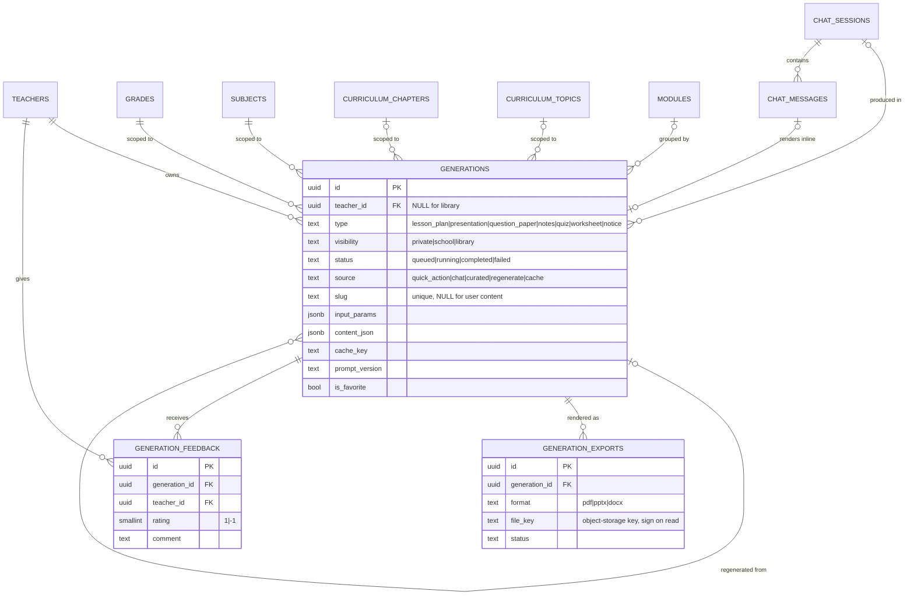

# Medha v2 — Schema Plan

**Status:** design, not yet implemented
**Migration head at time of writing:** `0009_voice_turns`
**Companion docs:** `medha-v2-backend.md`, `medha-v2-frontend.md`

The product is splitting into two domains that share nothing but the teacher
and the curriculum tables:

| Domain | Surface | Durable output |
|---|---|---|
| **Ask Medha** | typed chat + voice, scoped to grade + subject (+ optional chapter) | none — conversation only |
| **Content Generation** | quick-action forms per type | a `generations` row (lesson plan, deck, question paper, notes, quiz, …) |

Today `chat/service.py` does both: every chat turn also upserts a `Module` +
`ModuleArtifact`. v2 stops that. Chat becomes pure conversation; generation gets
its own table, routers, pipeline, and history.

This doc is the schema half. It adopts the polymorphic `generations` design from
`medha_generation_schema` (pasted in the planning thread) and reconciles it with
the **additive-migration constraint**: existing prod data (teachers, curriculum,
schools, chat sessions, voice turns, modules, library presentations) is kept and
backfilled, never dropped-and-rebuilt.

---

## 1. New tables

### 1.1 `generations`

One row per AI-generated teaching artifact — teacher-owned or curated library.
Full model in `medha_generation_schema` §3; the essentials:

```
generations
  id                     uuid pk
  -- ownership & visibility
  teacher_id             uuid fk teachers(id) ON DELETE CASCADE   NULL only for library rows
  visibility             text  'private' | 'school' | 'library'   default 'private'
  published              bool  default true
  slug                   text  unique, NULL for user content       (idempotent curated seeds)
  -- what it is
  type                   text  CHECK IN (lesson_plan, presentation, question_paper,
                                         notes, quiz, worksheet, notice)
  title                  text
  description            text  NULL
  language               text  default 'hi'                        'hi' | 'hi-BiharBoli' | 'en'
  -- curriculum scope (same shape as chat_sessions)
  grade_id               uuid fk grades(id)                  NULL
  subject_id             uuid fk subjects(id)                NULL
  chapter_id             uuid fk curriculum_chapters(id)     NULL
  topic_id               uuid fk curriculum_topics(id)       NULL
  tags                   jsonb NULL
  -- provenance
  source                 text  'quick_action' | 'chat' | 'curated' | 'regenerate' | 'cache'
                               default 'quick_action'
  session_id             uuid fk chat_sessions(id) ON DELETE SET NULL   NULL
  parent_generation_id   uuid fk generations(id)   ON DELETE SET NULL   NULL   (regen / cache lineage)
  module_id              uuid fk modules(id)       ON DELETE SET NULL   NULL   (optional grouping)
  -- content
  input_params           jsonb NULL     form inputs (difficulty, count, marks scheme…)
  content_json           jsonb NULL     the generated body; shape varies by type (§2)
  -- lifecycle
  status                 text  CHECK IN (queued, running, completed, failed)  default 'queued'
  error_message          text  NULL
  completed_at           timestamptz NULL
  -- observability & grounding
  retrieved_chunk_ids    uuid[] NULL
  model                  text  NULL
  prompt_version         text  NULL
  tokens_in              int   NULL
  tokens_out             int   NULL
  generation_ms          int   NULL
  cache_key              text  NULL     sha256(type | chapter_id | norm(input_params) | language | prompt_version)
  -- user state
  is_favorite            bool  default false
  created_at             timestamptz default now()
  updated_at             timestamptz default now()
```

**Check constraints** (named, so a bad enum value fails loudly at write time):
`chk_gen_type`, `chk_gen_status`, `chk_gen_visibility`, and
`chk_gen_owner` = `visibility = 'library' OR teacher_id IS NOT NULL`.

**Indexes** (see §4 for the queries each serves):

| Name | Columns | Kind |
|---|---|---|
| `idx_gen_teacher_recent` | `(teacher_id, created_at DESC)` | btree |
| `idx_gen_teacher_type` | `(teacher_id, type, created_at DESC)` | btree |
| `idx_gen_curriculum` | `(grade_id, subject_id, chapter_id)` | btree |
| `idx_gen_cache_key` | `(cache_key)` | btree |
| `idx_gen_library` | `(type, grade_id, subject_id)` | **partial** `WHERE visibility='library' AND published` |
| `idx_gen_favorites` | `(teacher_id, created_at DESC)` | **partial** `WHERE is_favorite` |
| `idx_gen_title_trgm` | `title` | **GIN `gin_trgm_ops`**, added only when History search ships |

`pg_trgm` is not enabled yet — the trigram index is deferred to the migration
that adds title search, not `0010`.

### 1.2 `generation_exports`

A rendered file for a generation. Separate table because one artifact can have
several formats (a deck wants `.pptx` **and** `.pdf`) and each is produced
independently, possibly async.

```
generation_exports
  id                uuid pk
  generation_id     uuid fk generations(id) ON DELETE CASCADE
  format            text  CHECK IN (pdf, pptx, docx)
  file_key          text  NULL     object-storage KEY, never a signed URL
  file_size_bytes   int   NULL
  status            text  CHECK IN (queued, running, completed, failed)  default 'queued'
  error_message     text  NULL
  created_at        timestamptz default now()
  completed_at      timestamptz NULL
  UNIQUE (generation_id, format)
  INDEX idx_exports_generation (generation_id)
```

Store the **object-storage key**. Signed URLs expire; a persisted one rots into
a dead link. Sign on read. Until Cloudflare R2 is wired
(`ppt_storage_*` settings are still blank), `.pptx` keeps rendering on demand
in-memory as it does today and **writes no `generation_exports` row** — the
table is populated only once a real bucket exists. `medha-v2-backend.md` §6.

### 1.3 `generation_feedback`

Replaces `module_feedback`. Feedback on one artifact is actionable ("this quiz
was bad" → fix the quiz prompt); feedback on a bundle is not.

```
generation_feedback
  id              uuid pk
  generation_id   uuid fk generations(id) ON DELETE CASCADE
  teacher_id      uuid fk teachers(id)    ON DELETE CASCADE
  rating          smallint NULL     1 = up, -1 = down
  comment         text NULL
  created_at      timestamptz default now()
  UNIQUE (generation_id, teacher_id)
  INDEX idx_gen_feedback_generation (generation_id)
```

---

## 2. `content_json` shapes

One Pydantic model per type in `backend/src/backend/generation/schemas/` (new
package). LLM output is parsed and validated against it **before** the row flips
to `status='completed'`; a validation failure sets `status='failed'` with the
Pydantic error summary in `error_message` and streams an `error` frame.

| Type | Shape (informal) |
|---|---|
| `lesson_plan` | `{ periods: int, topic: str, periods_detail: [{ period_no, concept, learning_objective, learning_outcomes, teacher_learning_process, assessment, resources }], homework?: str }` — the columnar table from SAVRA screenshot 6 |
| `presentation` | `{ slides: [{ layout, title, bullets[], speaker_notes, image_prompt? }] }` — **identical to today's `LibraryPresentation.spec_json`**, rendered by the existing `backend.ppt.render_pptx` |
| `question_paper` | `{ total_marks, duration_min, general_instructions[], sections: [{ name, instructions, questions: [{ text, marks, type, answer? }] }] }` |
| `notes` | `{ sections: [{ heading, body_md, key_points[] }], summary, important_terms?: [{term, meaning}] }` |
| `quiz` | `{ questions: [{ q, type: mcq\|short\|truefalse, options[], answer, difficulty, explanation? }] }` — superset of today's `quiz-v1` |
| `worksheet` | `{ instructions, exercises: [{ prompt, workspace_lines?, answer? }] }` — added later, no schema change |
| `notice` | `{ audience, body_md, date?, signatory? }` — added later |

**Versioning:** every shape change bumps the type's `prompt_version`
(`lesson_plan-v1` → `-v2`). Readers keep a small compatibility shim so old rows
in a teacher's History still render. `prompt_version` is already a column, so
this is a code concern, not a migration.

---

## 3. Changes to existing tables

### 3.1 `chat_messages` — add `generation_id` (in `0010`)

SAVRA screenshot 4 shows a generated document rendered as a card **inside** the
conversation. When a chat turn produces an artifact (teacher types "make a quiz
on this"), the assistant message links it:

```python
    generation_id: Mapped[uuid.UUID | None] = mapped_column(
        UUID(as_uuid=True), ForeignKey("generations.id", ondelete="SET NULL")
    )
```

### 3.2 `chat_sessions` — unchanged columns, changed behavior

No column changes. The voice fields (`voice_summary`, `voice_reply_style`,
`voice_language`) stay. What changes is `chat/service.py`: it stops calling
`_upsert_module` / `_replace_explanation_artifact`. See backend doc §5.

### 3.3 `modules` — kept, now optional

SAVRA's History lists individual items, not bundles — but "everything for
Chapter 3" is a real workflow. `modules` survives as a **lightweight optional
collection**; `generations.module_id` is the (nullable) link. Cost: one nullable
column. `chat_sessions` no longer implies a module. If grouping UI isn't built
within ~a month, drop `modules` in a later migration.

`modules.session_id`, `.topic_id`, `.chapter_id` etc. stay as-is.

### 3.4 Deprecated, then dropped

| Table | Fate | Backfill target |
|---|---|---|
| `module_artifacts` | drop after backfill | `generations` (map `explanation`→`notes`, `quiz`→`quiz`, `activity`→`lesson_plan`) |
| `module_feedback` | drop after backfill | `generation_feedback` |
| `library_presentations` | drop after backfill | `generations` (`type='presentation'`, `visibility='library'`, `teacher_id=NULL`, `content_json = spec_json`, `slug` carried over) |

`ModuleArtifact` / `ModuleFeedback` / `LibraryPresentation` SQLAlchemy models
and their `__init__` exports are removed in the same migration that drops the
tables (`0012`), not before — the backfill migration (`0011`) still needs them.

---

## 4. Read patterns → index map

| Screen / call | Query | Index |
|---|---|---|
| History → **All** tab | `WHERE teacher_id=? ORDER BY created_at DESC LIMIT n` | `idx_gen_teacher_recent` |
| History → **Quizzes** tab (any type tab) | `WHERE teacher_id=? AND type=? ORDER BY created_at DESC` | `idx_gen_teacher_type` |
| Library browse | `WHERE visibility='library' AND published AND type=? AND grade_id=?` | `idx_gen_library` (partial, stays tiny) |
| Cache probe (before an LLM call) | `WHERE cache_key=? AND status='completed' LIMIT 1` | `idx_gen_cache_key` |
| Favourites view | `WHERE teacher_id=? AND is_favorite ORDER BY created_at DESC` | `idx_gen_favorites` (partial) |
| "Earlier for this chapter" (Ask Medha side panel) | `WHERE teacher_id=? AND chapter_id=? ORDER BY created_at DESC` | `idx_gen_curriculum` + `idx_gen_teacher_recent` |
| History search (later) | `WHERE teacher_id=? AND title ILIKE '%q%'` | `idx_gen_title_trgm` (deferred) |

Two of these are **partial** on purpose: library rows and favourites are a small
fraction of the table, so the indexes stay small and fast as `generations`
grows into the millions at state scale.

Do **not** add a GIN index on `content_json` — teachers search by title, and
indexing full JSONB bodies is expensive for little gain.

---

## 5. `cache_key` — the cost lever

Teachers across Bihar will request *"Class 8 Science, Chapter 1, quiz, medium,
10 questions"* thousands of times. `cache_key` lets a repeat request serve an
existing completed row instead of re-billing an LLM call.

```
cache_key = sha256(
    type
    | chapter_id (or grade_id+subject_id when no chapter)
    | canonical_json(input_params)      # keys sorted, defaults filled
    | language
    | prompt_version
)
```

On `POST /generate/{type}`: compute the key, look for a `completed` row with
that key (`visibility IN ('private','library')`, any teacher). On a hit, **copy**
the `content_json` into a fresh row for the requesting teacher with
`source='cache'`, `parent_generation_id = <original>` — instant, zero LLM spend,
and the teacher still gets their own editable/favouritable copy in History.
Config flag `generation_cache_enabled` (default on) so it can be killed if a
prompt regression is suspected.

---

## 6. Migration sequence

Ship in **three** Alembic migrations. `0010` is safe to deploy alone; the
backfills follow once the new write path is proven in production.

| Rev | down_revision | Does |
|---|---|---|
| **`0010_generations`** | `0009_voice_turns` | `CREATE TABLE generations, generation_exports, generation_feedback` + all non-trgm indexes + check constraints. `ALTER TABLE chat_messages ADD COLUMN generation_id uuid` + FK. `ALTER TABLE generations ADD COLUMN module_id` is part of the create. New models + `__init__` exports. **No data touched.** |
| **`0011_backfill_generations`** | `0010_generations` | Data-only. `INSERT INTO generations SELECT …` from `library_presentations` (→ presentation/library), `module_artifacts` (→ mapped types, `visibility='private'`, `source='chat'`, `session_id`/`module_id` carried), then `generation_feedback` from `module_feedback`. Idempotent guard: `WHERE NOT EXISTS (… matching slug / parent)`. Down = `DELETE FROM generations WHERE source IN ('curated','chat') AND created_at < :migration_ts` (documented as lossy). |
| **`0012_drop_legacy_module_tables`** | `0011_backfill_generations` | `DROP TABLE module_artifacts, module_feedback, library_presentations`. Remove their models + exports + the `modules`/`ppt`/`library` router code paths that referenced them. Keep `modules` + `Module`. Down recreates empty tables (data not restored — documented). |

Between `0010` and `0011`, the backend writes `generations` for all **new**
generation requests and still reads legacy tables for old History rows via a
thin compat layer (backend doc §7). After `0012`, the compat layer is deleted.

---

## 7. Deliberately out of scope now

- **Assessment lifecycle.** When a quiz is *assigned* and produces attempts and
  scores, it stops being a document. That's `quiz_assignments` + `quiz_attempts`
  referencing `generations.id` — a **new domain on top**, not a move. The
  generated quiz stays a `generations` row. Don't build it yet; the schema
  above doesn't block it.
- **`generations.visibility='school'`.** Column value is allowed by the check
  constraint so the enum is stable, but no endpoint sets or reads it until
  school-level sharing is a feature.
- **Async export jobs / a jobs table.** Renders are synchronous (small, like
  today's PPT). A `generation_exports.status` machine is in place for when a
  worker takes over, but no worker is built now.

---

## 8. ERD (generation domain)


